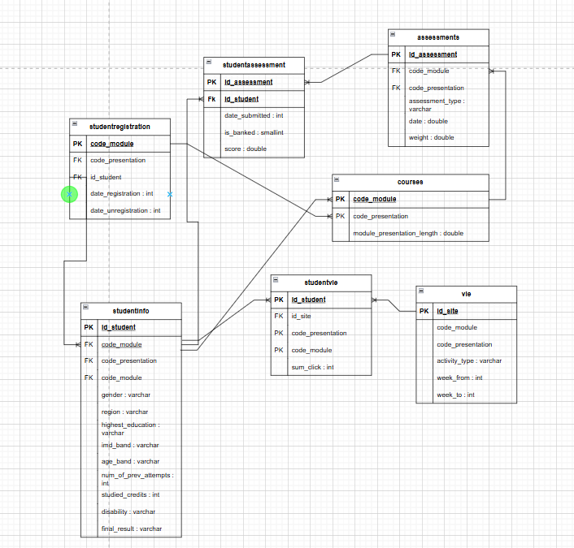
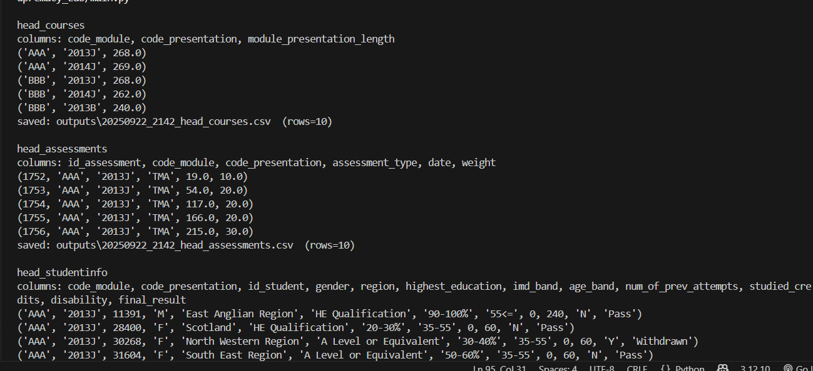
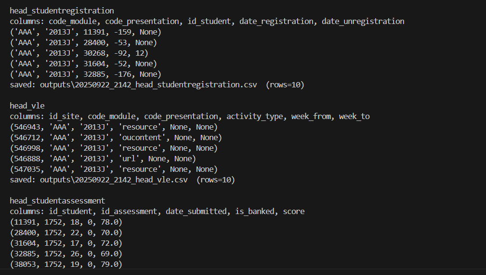
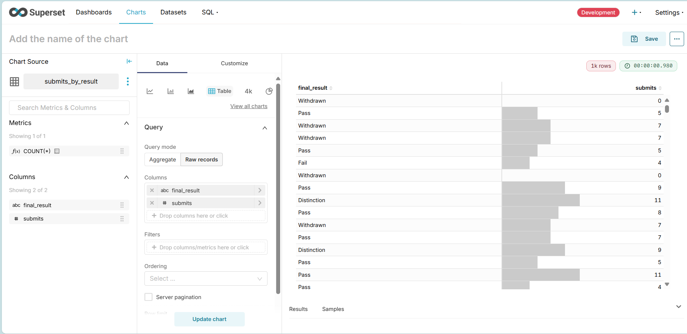
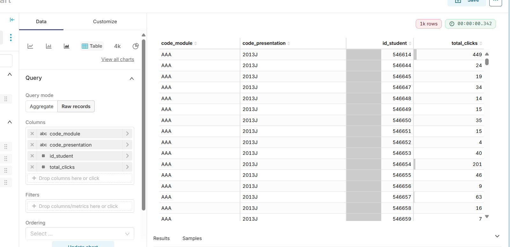
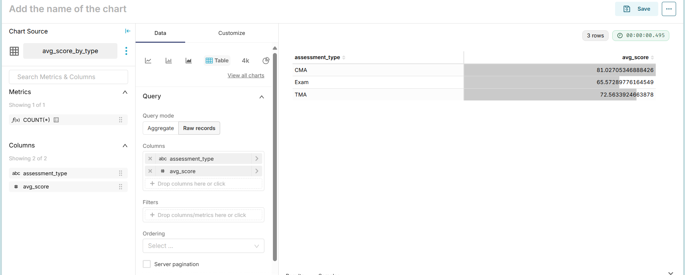
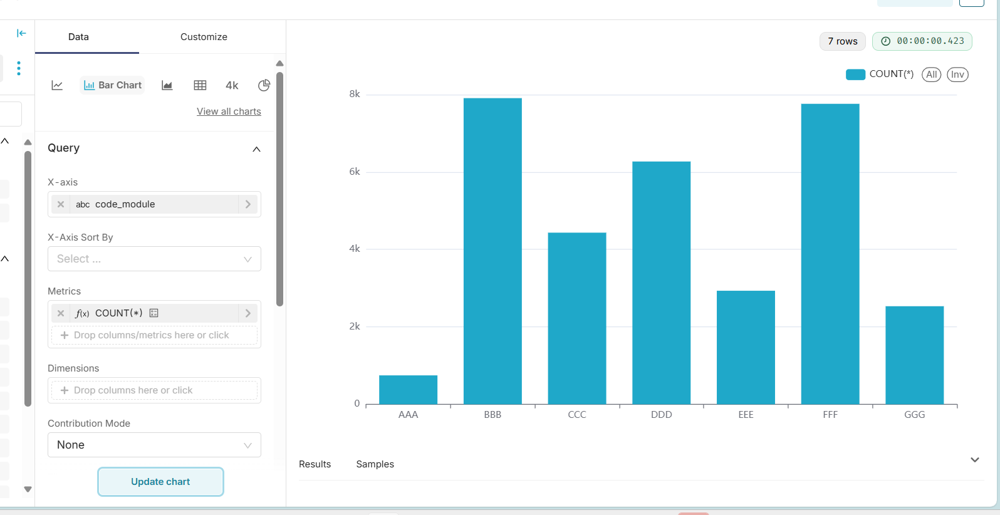

# ArcaneSupremacy_Lab

## О компании
ArcaneSupremacy_Lab — это аналитическая лаборатория, специализирующаяся на образовательной аналитике.  
Наша цель — выявлять закономерности в успеваемости студентов, анализировать их поведение в онлайн-среде и прогнозировать риски отчисления.  

## Цель проекта
Создать систему аналитики и прогнозирования **риска отчисления студентов** на основе исторических данных Open University Learning Analytics Dataset (OULAD).  https://www.kaggle.com/datasets/anlgrbz/student-demographics-online-education-dataoulad?resource=download
Система поможет:
- Анализировать академическую активность студентов.
- Выявлять группы риска.
- Прогнозировать вероятность dropout до завершения курса.

## Датасет
Используется **Open University Learning Analytics Dataset (OULAD)**:
- 7 связанных таблиц (`courses`, `studentInfo`, `studentRegistration`, `studentAssessment`, `assessments`, `studentVle`, `vle`).


## Основная аналитика
*(Временно вставлен ER-диаграммный скриншот, позже будет заменён дашбордом из Apache Superset)*  


## Как запустить проект
1. Установите PostgreSQL и создайте базу данных `ou_analytics`.
2. Импортируйте CSV-файлы OULAD в соответствующие таблицы.
3. Установите зависимости Python:
   ```bash
   pip install psycopg2





